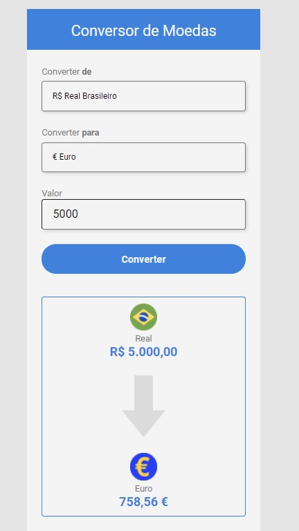

# Projeto Cadastro de Usuários 

> Projeto pessoal desenvolvido com o objetivo de aprimorar habilidades com HTML, CSS, JS e ReactJS.

### Criação do Projeto

O Projeto é um conversor de moedas que busca na rede a cada 30 segundos o valor atualizado de cada moeda e converte para o cambio desejado imediatamente.

Durante desenvolvimento do projeto foram utilizados diversos conceitos de JavaScript

